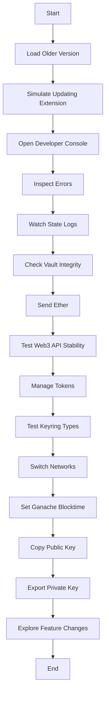

# QA Guide

## Table of Contents

1. [Introduction](#introduction)
2. [Browsers and OS](#browsers-and-os)
3. [Vault Integrity](#vault-integrity)
4. [Sending Ether](#sending-ether)
5. [Web3 API Stability](#web3-api-stability)
6. [Token Management](#token-management)
7. [Keyring Types](#keyring-types)
8. [Network Switching](#network-switching)
9. [Ganache Blocktime](#ganache-blocktime)
10. [Public and Private Keys](#public-and-private-keys)
11. [Feature Testing](#feature-testing)
12. [Detailed Usage Examples](#detailed-usage-examples)
13. [Visual Aids](#visual-aids)
14. [Video Tutorials](#video-tutorials)

## Introduction

This guide outlines the steps to mark a full pass of QA complete.

## Browsers and OS

* Browsers: Opera, Chrome, Firefox, Edge.
  * Use the Chrome build for all Chromium-derived browsers (e.g. Opera and Edge)
* OS: Ubuntu, Mac OSX, Windows

## Vault Integrity

* Load older version of MetaMask and attempt to simulate updating the extension.
* Open Developer Console in background and popup, inspect errors.
* Watch the state logs
  * Transactions (unapproved txs -> rejected/submitted -> confirmed)
  * Nonces/LocalNonces
* Vault integrity
    * create vault
    * Log out
    * Log in again
    * Log out
    * Restore from seed
    * Create a second account
    * Import a loose account (not related to HD Wallet)
    * Import old existing vault seed phrase (pref with test Ether)
    * Download State Logs, Priv key file, seed phrase file.

## Sending Ether

* Send Ether
    * by address
    * by ens name

## Web3 API Stability

* Web3 API Stability
    * Create a contract from a Ðapp (remix)
    * Load a Ðapp that reads using events/logs (ENS)
    * Connect to MEW/MyCypto
    * Send a transaction from any Ðapp
        - MEW
        - EtherDelta
        - Leeroy
        - Aragon
        - (https://tmashuang.github.io/demo-dapp)
    * Check account balances

## Token Management

* Token Management
    * create a token with tokenfactory (http://tokenfactory.surge.sh/#/factory)
    * Add that token to the token view
    * Send that token to another metamask address.
    * confirm the token arrived.

## Keyring Types

* Send a transaction and sign a message (https://danfinlay.github.io/js-eth-personal-sign-examples/) for each keyring type
    * hd keyring
    * imported keyring

## Network Switching

* Change network from mainnet → ropsten → rinkeby → localhost (ganache)

## Ganache Blocktime

* Ganache set blocktime to simulate retryTx in MetaMask

## Public and Private Keys

* Copy public key to clipboard
* Export private key

## Feature Testing

* Explore changes in master, target features that have been changed and break.

## Detailed Usage Examples

### Example 1: Testing Vault Integrity

1. Create a new vault in MetaMask.
2. Log out and log in again to ensure the vault is accessible.
3. Restore the vault from the seed phrase.
4. Create a second account and import a loose account.
5. Import an old existing vault seed phrase with test Ether.
6. Download State Logs, Priv key file, and seed phrase file.

### Example 2: Sending Ether

1. Send Ether by address.
2. Send Ether by ens name.

## Visual Aids

### Diagram: MetaMask QA Process

### Flowchart: QA Steps

## Video Tutorials

### Tutorial 1: Testing Vault Integrity

### Tutorial 2: Sending Ether

