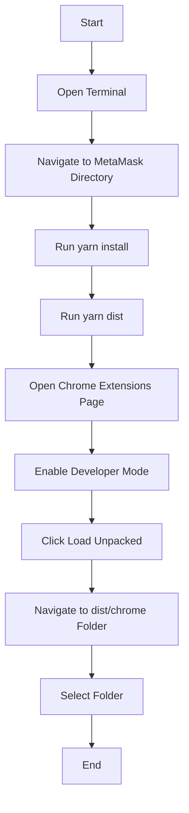

# Add Custom Build to Chrome

## Table of Contents

1. [Introduction](#introduction)
2. [Prerequisites](#prerequisites)
3. [Building MetaMask](#building-metamask)
4. [Adding to Chrome](#adding-to-chrome)
5. [Detailed Usage Examples](#detailed-usage-examples)
6. [Visual Aids](#visual-aids)
7. [Video Tutorials](#video-tutorials)

## Introduction

This guide provides step-by-step instructions on how to add a custom build of MetaMask to the Chrome browser.

## Prerequisites

Before you begin, ensure you have the following:

- Node.js installed on your system
- Yarn package manager installed
- A clone of the MetaMask repository

## Building MetaMask

1. Open a terminal and navigate to the root directory of the MetaMask repository.
2. Run `yarn install` to install the necessary dependencies.
3. Run `yarn dist` to create a local build of MetaMask. The build will be created in the `dist/chrome` folder.

## Adding to Chrome

1. Open Chrome and go to `Settings` > `Extensions`.
   - Or go straight to [chrome://extensions](chrome://extensions).
2. Check "Developer mode" in the top right corner.
3. Click the `Load Unpacked` button.
4. Navigate to the `metamask-extension/dist/chrome` folder and select it.
5. Click `Select Folder`.

Your custom build of MetaMask is now added to Chrome. You can click `Inspect views background.html` in its card on the extension settings page to view its dev console.

## Detailed Usage Examples

### Example 1: Adding Custom Build to Chrome on Windows

1. Follow the steps in the [Building MetaMask](#building-metamask) section to create a local build.
2. Open Chrome and go to `Settings` > `Extensions`.
3. Check "Developer mode" in the top right corner.
4. Click the `Load Unpacked` button.
5. Navigate to the `metamask-extension/dist/chrome` folder and select it.
6. Click `Select Folder`.

### Example 2: Adding Custom Build to Chrome on macOS

1. Follow the steps in the [Building MetaMask](#building-metamask) section to create a local build.
2. Open Chrome and go to `Settings` > `Extensions`.
3. Check "Developer mode" in the top right corner.
4. Click the `Load Unpacked` button.
5. Navigate to the `metamask-extension/dist/chrome` folder and select it.
6. Click `Select Folder`.

### Example 3: Adding Custom Build to Chrome on Linux

1. Follow the steps in the [Building MetaMask](#building-metamask) section to create a local build.
2. Open Chrome and go to `Settings` > `Extensions`.
3. Check "Developer mode" in the top right corner.
4. Click the `Load Unpacked` button.
5. Navigate to the `metamask-extension/dist/chrome` folder and select it.
6. Click `Select Folder`.

## Visual Aids

### Diagram: Adding Custom Build to Chrome

### Flowchart: Adding Custom Build to Chrome

## Video Tutorials

### Tutorial 1: Adding Custom Build to Chrome on Windows

### Tutorial 2: Adding Custom Build to Chrome on macOS

### Tutorial 3: Adding Custom Build to Chrome on Linux

