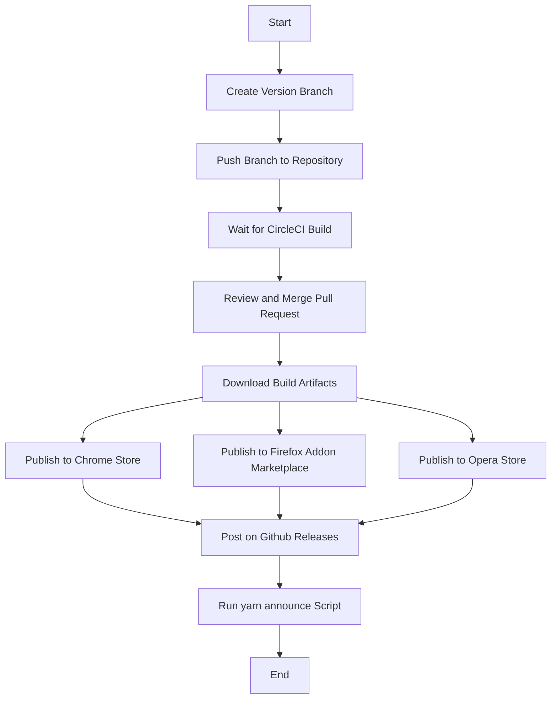

# Publishing Guide

When publishing a new version of MetaMask, we follow this procedure:

## Overview

The below diagram outlines our process for design, development, and release. Building MetaMask is a community affair, and many steps of the process invite participation from external contributors as indicated. All QA, code review, and release of new versions is done by members of the core MetaMask team.

## Table of Contents

1. [Preparation](#preparation)
2. [Incrementing Version & Changelog](#incrementing-version--changelog)
3. [Preparing for Sensitive Changes](#preparing-for-sensitive-changes)
4. [Building](#building)
5. [Publishing](#publishing)
6. [Hotfix Differences](#hotfix-differences)
7. [Detailed Usage Examples](#detailed-usage-examples)
8. [Visual Aids](#visual-aids)
9. [Video Tutorials](#video-tutorials)

## Preparation

We try to ensure certain criteria are met before deploying:

- Deploy early in the week, to give time for emergency responses to unforeseen bugs.
- Deploy early in the day, for the same reason.
- Make sure at least one member of the support team is "on duty" to watch for new user issues coming through the support system.
- Roll out incrementally when possible, to a small number of users first, and gradually to more users.

## Incrementing Version & Changelog

Version can be automatically incremented by creating a branch with the name `Version-vX.Y.Z`, where `X`, `Y`, and `Z` are numbers. Branches should be created off of the main branch. [Branches can be created on GitHub.](https://help.github.com/en/articles/creating-and-deleting-branches-within-your-repository)

Once a version branch has been created, a build on CircleCI will create a Pull Request for the release with the app manifest and changelog versions bumped.

## Preparing for Sensitive Changes

In the case that a new release has sensitive changes that cannot be fully verified prior to publication, please follow the [sensitive release protocol](./sensitive-release.md).

## Building

While we develop on the main `develop` branch, our production version is maintained on the `master` branch.

With each pull request, the @MetaMaskBot will comment with a build of that new pull request, so after bumping the version on `develop`, open a pull request against `master`, and once the pull request is reviewed and merged, you can download those builds for publication.

## Publishing

1. Publish to chrome store.
2. Visit [the chrome developer dashboard](https://chrome.google.com/webstore/developer/dashboard?authuser=2).
3. Publish to [firefox addon marketplace](http://addons.mozilla.org/en-us/firefox/addon/ether-metamask).
4. Publish to [Opera store](https://addons.opera.com/en/extensions/details/metamask/).
5. Post on [Github releases](https://github.com/MetaMask/metamask-extension/releases) page.
6. Run the `yarn announce` script, and post that announcement in our public places.

## Hotfix Differences

Our `develop` branch is usually not yet fully tested for quality assurance, and so should be treated as if it is in an unstable state.

For this reason, when an urgent change is needed in production, its pull request should:

- Describe it as a hotfix.
- Use a hotfix tag.
- Should be proposed against the `master` branch.

The version and changelog bump should then be made off the `master` branch, and then merged to `develop` to bring the two branches back into sync. Further time can be saved by incorporating the version/changelog bump into the PR against `master`, since we rely on @MetaMaskBot to run tests before merging.

## Detailed Usage Examples

### Example 1: Publishing a New Version

1. Create a branch with the name `Version-vX.Y.Z`.
2. Push the branch to the repository.
3. Wait for the CircleCI build to complete and create a Pull Request.
4. Review the Pull Request and merge it into the `master` branch.
5. Download the build artifacts from the CircleCI build.
6. Follow the steps in the [Publishing](#publishing) section to publish the new version.

### Example 2: Preparing a Rollback Release

1. Create a branch off of the latest release with the name `Version-vX.Y.Z-rollback`.
2. Increment the patch version number in the app manifest and changelog.
3. Push the branch to the repository.
4. Wait for the CircleCI build to complete and create a Pull Request.
5. Review the Pull Request and merge it into the `master` branch.
6. Download the build artifacts from the CircleCI build.
7. Keep the rollback release ready for immediate deployment in case of emergency.

## Visual Aids

### Diagram: MetaMask Development Process

### Flowchart: Publishing Process

## Video Tutorials

### Tutorial 1: Publishing a New Version

### Tutorial 2: Preparing a Rollback Release

